# ИИ-агент для автоматизации рабочих процессов

## Часть I. Краткое описание

## Цель

Создать ИИ-агента для автоматизации корпоративных рабочих процессов.

Система получает события из интегрированных систем, выбирает подходящий сценарий и выполняет его как граф шагов. Шаги могут запускать AI-агента, выполнять заранее заданную команду или ожидать ревью пользователя.

### Локальные аналоги для разработки

Целевыми корпоративными системами остаются Jira и Confluence. До подключения рабочих экземпляров в локальной среде разработки используются совместимые аналоги:

- Plane вместо Jira — источник задач и событий о готовности задачи к разработке;
- BookStack вместо Confluence — источник документации, доступный через SWIRL.

Эта замена относится только к среде разработки. Границы интеграций сохраняются: система задач подключается через обработчик внешних событий, а база знаний — через SWIRL. Сценарии и внутренние модели не должны зависеть от особенностей конкретного локального аналога.

На устройствах с малым объёмом памяти основной режим разработки не поднимает Gitea, полный SWIRL и Redis постоянно. Gitea включается по требованию, а договор SWIRL проверяется лёгким совместимым сервисом по локальным JSON-документам. Полный SWIRL запускается отдельно для интеграционных проверок. Лёгкий сервис не является заменой SWIRL в целевой среде.

## Общая схема

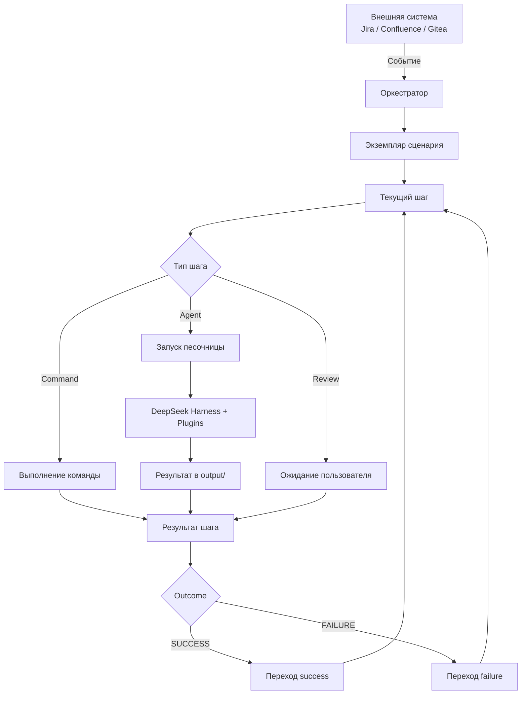

## Основные компоненты

### Оркестратор

Монолитное приложение, которое:

- принимает внешние события;
- выбирает сценарий;
- создаёт и ведёт экземпляр workflow;
- выполняет граф шагов;
- отслеживает состояния workflow и шагов;
- запускает Docker-песочницы;
- выбирает готовый образ с нужными плагинами;
- при необходимости собирает новый Docker-образ;
- формирует контекст для следующего Agent Step;
- управляет Review Step;
- интегрируется с Gitea и SWIRL;
- предоставляет dashboard состояния выполнения.

### Песочница

Docker-контейнер, создаваемый для отдельного запуска агента.

Внутри находятся:

- DeepSeek Harness;
- заранее установленные плагины;
- рабочее окружение;
- директория `output/` для результата.

### SWIRL

Слой федеративного поиска по корпоративным источникам. Агенты получают доступ к корпоративным данным через соответствующий plugin и SWIRL.

### Trigger

Внешнее событие из Jira, Confluence, Gitea или другой интегрированной системы, которое создаёт новый экземпляр workflow.

## Сценарий

Сценарий описывается в JSON и представляет собой граф шагов.

Каждый шаг должен иметь план перехода как минимум для двух бизнес-результатов:

- `SUCCESS`;
- `FAILURE`.

Граф может содержать циклы.

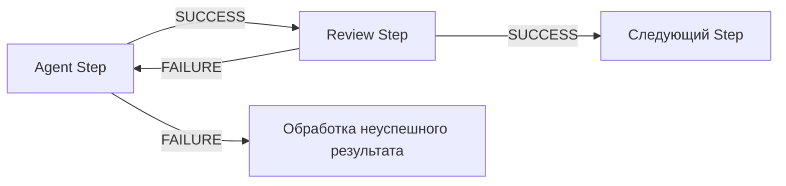

## Типы шагов

В системе предусмотрено три типа Step:

1. **Command Step** — выполнение заранее определённой команды.
2. **Agent Step** — запуск AI-агента в Docker-песочнице.
3. **Review Step** — ожидание решения пользователя.

Review является полноценным шагом workflow. Пока пользователь не завершит ревью, дальнейшее выполнение графа не продолжается.

## Review через Gitea

Агент может подготовить изменения и создать Merge Request в Gitea.

- Если пользователь принимает изменения, Review Step завершается с `SUCCESS`.
- Если пользователь оставляет замечания и требует доработки, Review Step завершается с `FAILURE`.
- Ветка `FAILURE` может вернуть workflow на предыдущий Agent Step.
- Оркестратор формирует для повторного запуска агента новый контекст с комментариями пользователя.

Финальное применение изменений требует участия пользователя.

## Plugins и Docker Images

В JSON-конфигурации Agent Step указываются названия необходимых плагинов, например:

```json
{
  "type": "agent",
  "plugins": [
    "git",
    "gitea",
    "swirl",
    "python"
  ]
}
```

Оркестратор:

1. ищет заранее подготовленный Docker-образ с необходимым набором плагинов;
2. запускает его, если подходящий образ найден;
3. если подходящего образа нет — собирает новый;
4. сохраняет собранный образ для повторного использования.

Отдельная модель permissions/capabilities на уровне сценария не требуется: сценарий задаёт именно необходимые плагины.

## Передача контекста между шагами

Результат предыдущего агента не передаётся следующему агенту целиком.

Оркестратор формирует вход следующего шага на основании контекста workflow:

- результата предыдущих шагов;
- причины `SUCCESS` или `FAILURE`;
- пользовательских комментариев;
- ссылок на artifacts;
- данных Trigger;
- конфигурации сценария.

Таким образом, следующий агент получает только релевантную для своей задачи информацию.

## Состояния и ошибки

Бизнес-результат шага отделяется от технического состояния выполнения.

**Outcome:**

- `SUCCESS`;
- `FAILURE`.

**Техническая ошибка:**

- `ERROR`.

`ERROR` не является переходом по ветке `FAILURE`: технические ошибки обрабатываются механизмом retry.

## Idempotency и Retry

Система должна:

- не создавать повторный workflow при повторной доставке одного Trigger;
- идентифицировать каждый запуск Step;
- поддерживать повторные итерации одного Step в циклах графа;
- отдельно учитывать технические retry;
- не создавать повторные внешние сущности при повторном выполнении операции.

## Определения

**Оркестратор** — монолитное приложение, управляющее сценарием, состояниями, выполнением шагов, песочницами, review и интеграциями.

**Сценарий / Workflow** — JSON-описание графа шагов и переходов между ними.

**Шаг / Step** — атомарный элемент сценария одного из типов `command`, `agent`, `review`.

**Агент** — AI-исполнитель Agent Step.

**Sandbox / Песочница** — изолированный Docker-контейнер для запуска агента.

**Plugin** — установленное в образ расширение, предоставляющее агенту дополнительную возможность.

**Agent Image** — Docker-образ с DeepSeek Harness и определённым набором плагинов.

**Trigger** — внешнее событие, создающее экземпляр workflow.

**Review Step** — шаг, ожидающий решение пользователя и завершающийся `SUCCESS` либо `FAILURE`.

**Step Outcome** — бизнес-результат выполнения шага: `SUCCESS` или `FAILURE`.

**Execution Status** — техническое состояние исполнения шага.

**SWIRL** — система федеративного поиска по корпоративным источникам.

**Context Builder** — логика оркестратора, формирующая релевантный вход следующего Agent Step из состояния и истории workflow.

**Artifact** — файл или внешняя сущность, созданная в ходе выполнения шага и доступная последующим шагам по ссылке или идентификатору.


---

## Часть II. Подробное описание архитектуры

## 1. Назначение системы

Необходимо реализовать ИИ-агентную платформу для автоматизации корпоративных рабочих процессов.

Система работает по событийной модели:

1. во внешней системе происходит событие;
2. внешний источник отправляет Trigger оркестратору;
3. оркестратор выбирает соответствующий сценарий;
4. создаётся экземпляр workflow;
5. workflow выполняется как граф шагов;
6. результат каждого шага определяет дальнейший переход по графу;
7. при необходимости выполнение блокируется на Review Step до решения пользователя.

Оркестратор реализуется как **монолитное приложение**.

---

## 2. Архитектурные принципы

### 2.1. Монолит

Все основные функции размещаются внутри одного приложения:

- Trigger Handler;
- Scenario Registry;
- Workflow Engine;
- State Machine;
- Step Executor;
- Context Builder;
- Sandbox Manager;
- Image Resolver;
- Image Builder;
- Review Manager;
- Gitea Integration;
- SWIRL Integration;
- Artifact Manager;
- Dashboard;
- механизмы retry и idempotency.

Это логические модули одного приложения, а не отдельные сервисы.

### 2.2. Workflow как граф

Сценарий не является простой линейной цепочкой.

Он представляет собой ориентированный граф, где каждый Step имеет переходы как минимум для:

- `SUCCESS`;
- `FAILURE`.

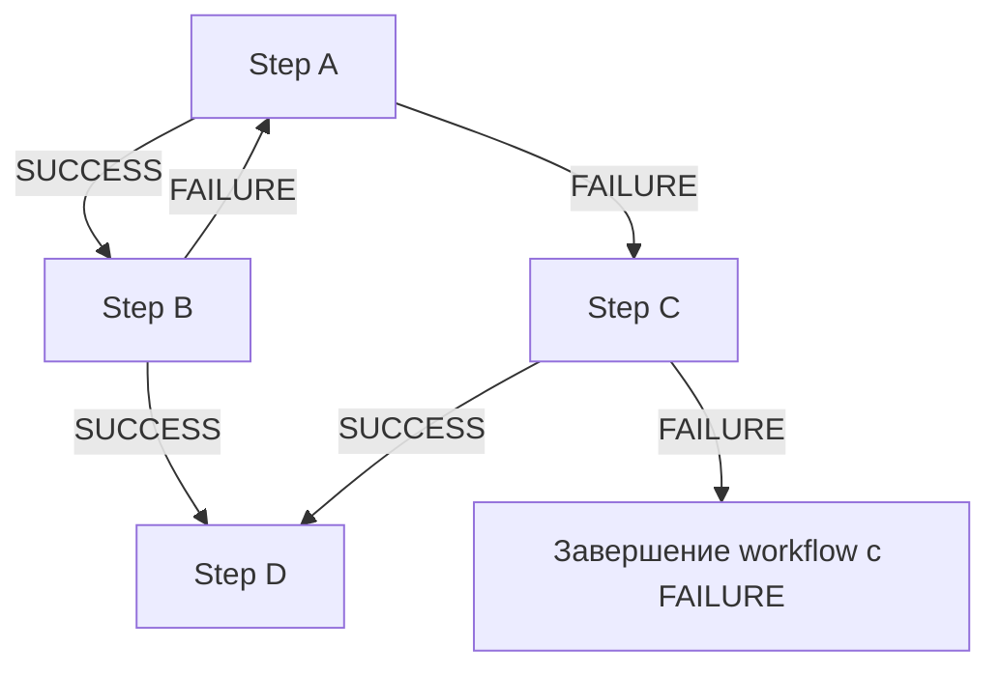

Граф может содержать циклы, что необходимо, например, для повторной доработки кода после пользовательского review.

---

## 3. Основные сущности

### Trigger

Внешнее событие, инициирующее создание нового workflow.

Примеры источников:

- Jira;
- Confluence;
- Gitea;
- другие корпоративные системы.

Примеры событий:

```text
jira.issue.created
gitea.pull_request.updated
confluence.page.updated
```

### Scenario

JSON-конфигурация, описывающая:

- тип Trigger;
- стартовый Step;
- набор Step;
- тип каждого Step;
- параметры выполнения;
- необходимые плагины;
- retry policy;
- переходы по `SUCCESS`;
- переходы по `FAILURE`.

### Workflow Instance

Конкретный запуск Scenario, созданный в результате Trigger.

Workflow хранит:

- `workflow_id`;
- Trigger data;
- текущий workflow state;
- историю Step Execution;
- историю переходов;
- доступные artifacts;
- пользовательские review;
- контекст выполнения.

### Step

Атомарный элемент Scenario.

Существует ровно три базовых типа:

- `command`;
- `agent`;
- `review`.

### Step Execution

Конкретное выполнение Step внутри Workflow Instance.

Один Step может выполняться несколько раз из-за циклов графа.

Кроме того, одна итерация Step может иметь несколько технических попыток из-за retry.

---

## 4. Общий поток выполнения

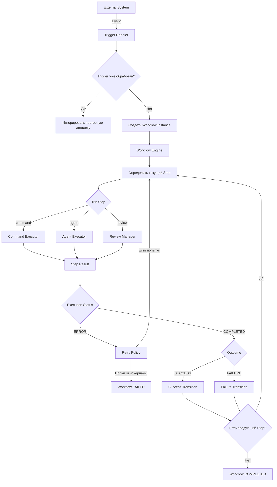

---

## 5. Типы Step

## 5.1. Command Step

Command Step выполняет заранее определённую команду без участия AI-агента.

Примеры:

- обработка файлов;
- запуск локального скрипта;
- преобразование данных;
- выполнение детерминированной внутренней операции.

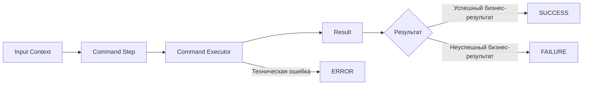

---

## 5.2. Agent Step

Agent Step запускает AI-агента в отдельной Docker-песочнице.

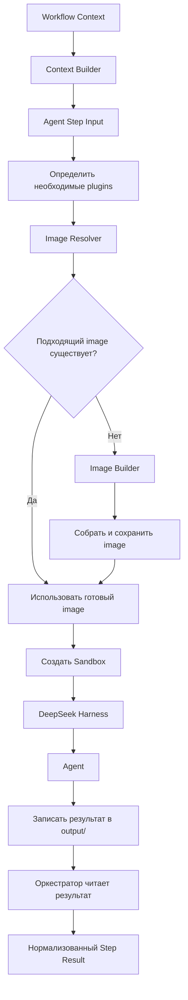

---

## 5.3. Review Step

Review Step является полноценным шагом workflow.

Он не является дополнительной проверкой поверх другого Step.

При входе в Review Step workflow переходит в состояние ожидания и не продолжает выполнение до пользовательского действия.

Основной сценарий — review изменений через Merge Request в Gitea.

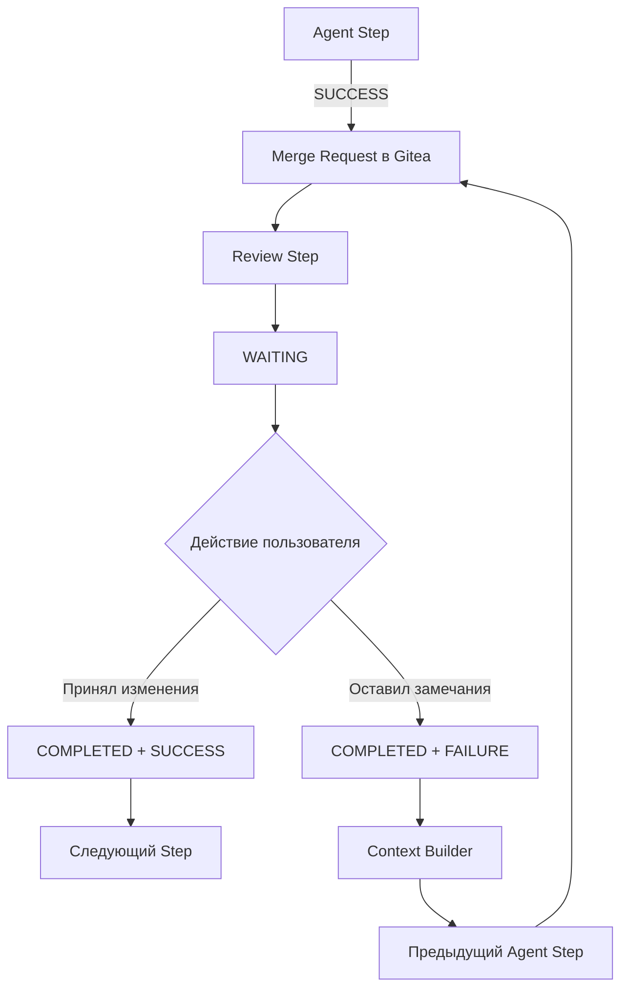

Review Step может повторяться столько раз, сколько предусмотрено графом.

---

## 6. Step Outcome и Execution Status

Необходимо строго разделять:

1. бизнес-результат Step;
2. технический статус его выполнения.

### 6.1. Outcome

Outcome определяет переход по графу:

```text
SUCCESS
FAILURE
```

Примеры:

- агент решил задачу → `SUCCESS`;
- агент корректно завершил работу, но не смог получить требуемый бизнес-результат → `FAILURE`;
- пользователь принял MR → `SUCCESS`;
- пользователь запросил доработку → `FAILURE`.

### 6.2. Execution Status

Техническое состояние исполнения:

```text
PENDING
READY
RUNNING
WAITING
COMPLETED
ERROR
CANCELLED
```

Примеры `ERROR`:

- Docker не смог запустить контейнер;
- Gitea API временно недоступна;
- SWIRL завершился по timeout;
- оркестратор не смог прочитать обязательный `result.json`.

`ERROR` не должен автоматически означать `FAILURE`.

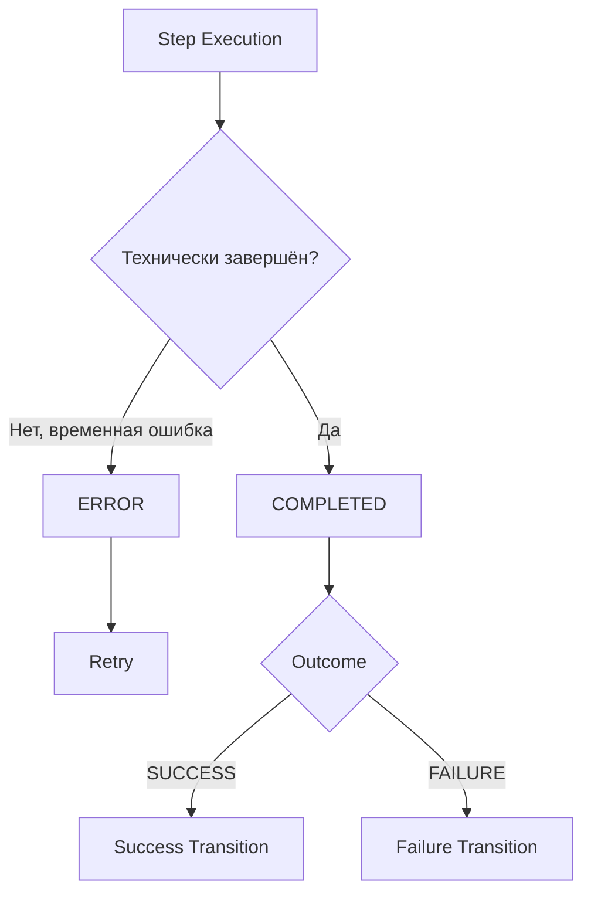

---

## 7. Workflow State Machine

Workflow и Step должны иметь разные состояния.

### 7.1. Workflow State

Базовый набор:

- `CREATED`;
- `RUNNING`;
- `WAITING`;
- `COMPLETED`;
- `FAILED`;
- `CANCELLED`.

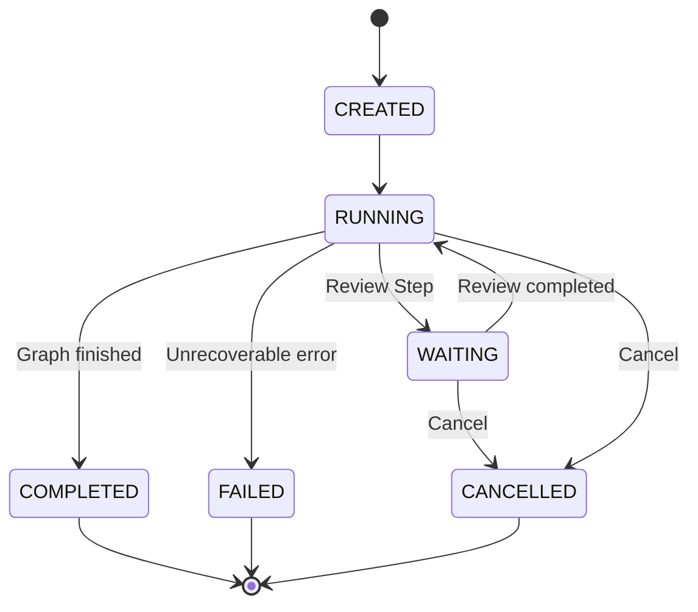

### 7.2. Step Execution State

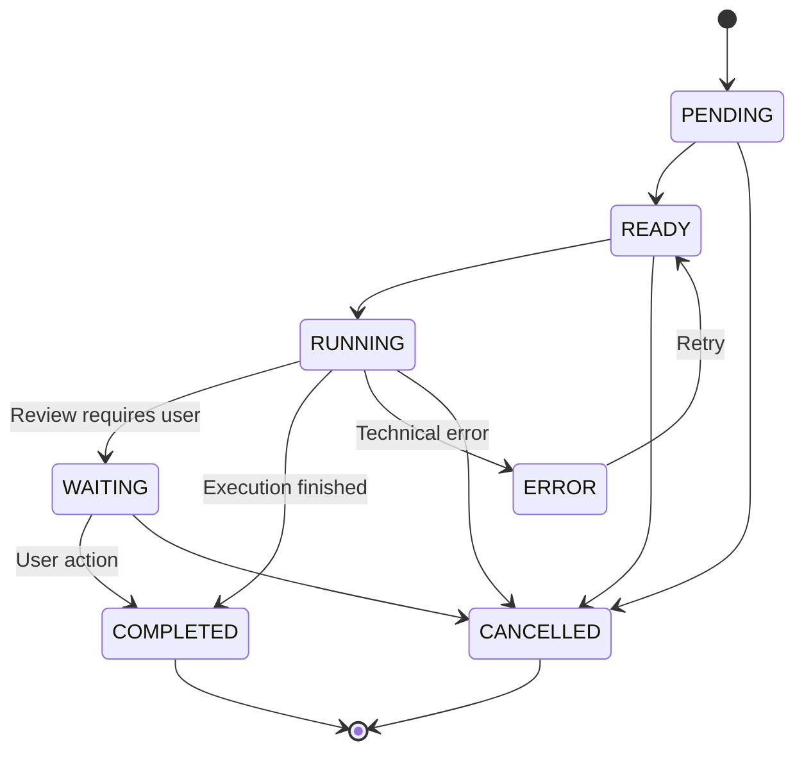

У `COMPLETED` дополнительно хранится:

```text
outcome = SUCCESS | FAILURE
```

---

## 8. Review через Gitea

Агентам разрешается подготовить изменения и создать Merge Request в Gitea.

Типичный процесс:

1. Agent Step получает задачу.
2. Агент создаёт или использует рабочую branch.
3. Изменяет код.
4. Создаёт commit.
5. Push изменений.
6. Создаёт или обновляет Merge Request.
7. Agent Step завершается.
8. Workflow переходит в Review Step.
9. Пользователь просматривает изменения.
10. Решение пользователя становится Outcome Review Step.

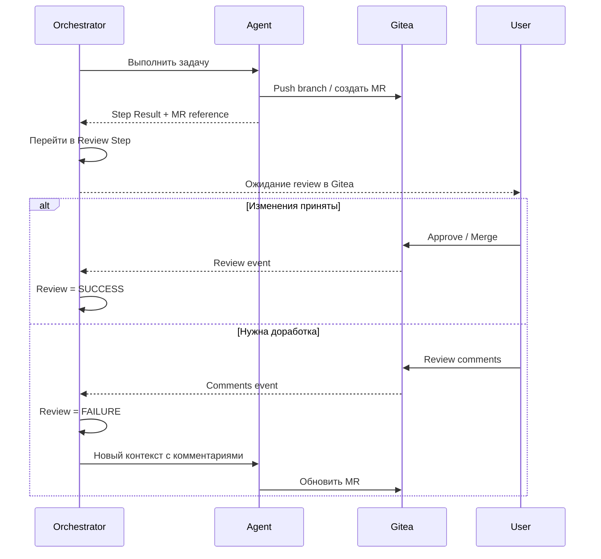

Создание MR является частью автоматизированного процесса, однако финальное принятие изменений остаётся за пользователем.

---

## 9. Plugins и Docker Images

Для Agent Step в JSON указываются **названия требуемых плагинов**.

Отдельное описание permissions или capability-level разрешений не требуется.

Пример:

```json
{
  "id": "implement_changes",
  "type": "agent",
  "plugins": [
    "git",
    "gitea",
    "swirl",
    "python"
  ]
}
```

Оркестратор должен поддерживать набор заранее подготовленных Docker-образов с различными комбинациями плагинов.

Примеры логических образов:

```text
base-agent
code-agent
documentation-agent
data-agent
```

Название образа не обязано присутствовать в Scenario. Scenario описывает необходимые plugins.

### Image Resolution

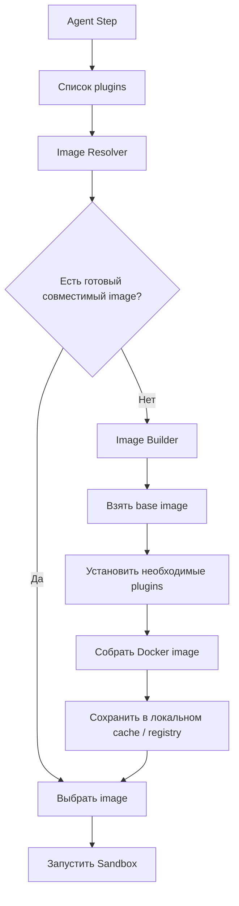

Подходящий image должен содержать как минимум все plugins, необходимые конкретному Agent Step.

Повторно собранные комбинации должны кешироваться.

---

## 10. Sandbox

Каждый запуск Agent Step выполняется в отдельном Docker-контейнере.

Песочница содержит:

- DeepSeek Harness;
- необходимые plugins;
- рабочую директорию;
- входной контекст;
- директорию `output/`.

Минимальная структура результата:

```text
/output/
    result.json
    artifacts/
```

`result.json` является обязательным машинно-читаемым контрактом между Sandbox и Orchestrator.

Пример:

```json
{
  "status": "success",
  "summary": "Изменения подготовлены",
  "artifacts": [
    {
      "type": "merge_request",
      "ref": "gitea://backend/pulls/123"
    }
  ]
}
```

После завершения контейнера оркестратор считывает содержимое `output/`, валидирует результат и переводит его во внутреннюю модель Step Result.

---

## 11. Модель данных между шагами

Raw output одного Agent Step **не должен автоматически передаваться целиком следующему Agent Step**.

Оркестратор должен формировать вход каждого Agent Step в соответствии с текущим контекстом Scenario.

Для этого внутри монолита выделяется логика **Context Builder**.

### Источники контекста

Context Builder может использовать:

- Trigger data;
- конфигурацию текущего Step;
- Outcome предыдущего Step;
- структурированные результаты предыдущих Step;
- необходимые artifacts;
- историю workflow;
- ошибки или причины неуспешного результата;
- пользовательские review comments;
- ссылки на Gitea MR;
- результаты поиска через SWIRL.

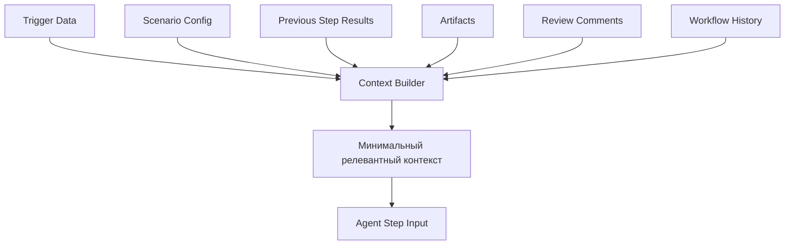

### Пример: переход после успешного шага

Вместо полного результата предыдущего агента новый Agent Step может получить:

```text
Предыдущий этап анализа завершён успешно.
Обнаружены проблемы: ...
Используй эти выводы для подготовки исправлений.
Релевантный отчёт: artifact://workflow-456/analysis/report.md
```

### Пример: предыдущий Agent Step завершился с FAILURE

Следующий Agent Step может получить:

```text
Предыдущая попытка завершилась без достижения требуемого результата.

Причина:
...

Попробуй альтернативный подход с учётом указанной причины.
```

### Пример: Review Step завершился с FAILURE

Повторно запускаемый агент получает контекст вида:

```text
Пользователь запросил доработку существующего Merge Request.

MR:
gitea://backend/pulls/123

Комментарии пользователя:
- ...
- ...

Обнови существующие изменения с учётом замечаний.
```

Таким образом, передача информации между шагами является **семантической**, а не механическим проксированием output предыдущего агента.

---

## 12. Step Result

Внутри оркестратора каждый Step должен иметь унифицированный результат.

Пример:

```json
{
  "step_id": "implement_changes",
  "execution_id": "exec-123",
  "iteration": 2,
  "attempt": 1,
  "execution_status": "COMPLETED",
  "outcome": "SUCCESS",
  "data": {
    "summary": "Изменения реализованы"
  },
  "artifacts": [
    {
      "type": "merge_request",
      "uri": "gitea://backend/pulls/123"
    }
  ]
}
```

### `data`

Небольшие структурированные данные, пригодные для работы оркестратора и Context Builder.

### `artifacts`

Ссылки на более крупные результаты:

- Merge Request;
- файлы;
- отчёты;
- patch;
- документы;
- другие внешние или внутренние сущности.

Step Result является внутренним контрактом оркестратора. Формат конкретного агента из `output/` может быть преобразован в эту модель после валидации.

---

## 13. SWIRL

SWIRL используется как единый слой федеративного поиска по корпоративным источникам.

Агенты не обязаны реализовывать отдельную интеграцию с каждым источником.

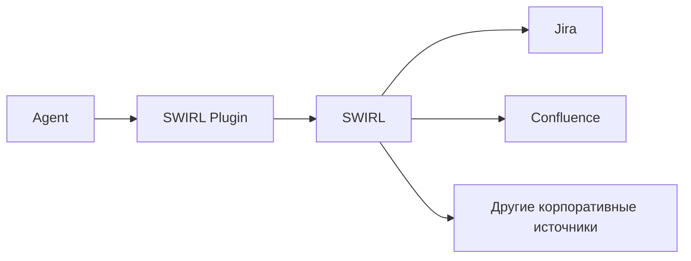

Такой подход позволяет централизовать доступ к данным и поиск, сохраняя единый интерфейс для агентов.

---

## 14. Idempotency

Idempotency необходима на нескольких уровнях.

### 14.1. Trigger

Повторная доставка одного webhook не должна создавать второй Workflow Instance.

Ключ может строиться из:

```text
source + external_event_id
```

### 14.2. Step Execution

Для каждого исполнения необходимо хранить:

```text
workflow_id
step_id
iteration
attempt
```

Где:

- `iteration` — номер логического выполнения Step в графе;
- `attempt` — номер технической попытки внутри одной iteration.

Например после двух циклов review:

```text
implement_changes / iteration 1 / attempt 1
review_changes    / iteration 1 / attempt 1
implement_changes / iteration 2 / attempt 1
review_changes    / iteration 2 / attempt 1
```

А при техническом retry:

```text
implement_changes / iteration 2 / attempt 1
implement_changes / iteration 2 / attempt 2
```

### 14.3. Внешние операции

Операции вроде создания Merge Request также должны быть защищены от дублирования.

После retry система не должна создавать несколько одинаковых MR, если предыдущая попытка фактически успела выполнить операцию.

---

## 15. Retry

Retry применяется только к технической ошибке выполнения.

Примеры:

| Ситуация | Результат |
|---|---|
| Docker daemon временно недоступен | `ERROR → retry` |
| SWIRL timeout | `ERROR → retry` |
| Gitea API временно недоступна | `ERROR → retry` |
| Agent корректно завершил работу, но не решил задачу | `COMPLETED + FAILURE` |
| Пользователь запросил изменения | `COMPLETED + FAILURE` |

Пример конфигурации:

```json
{
  "retry": {
    "max_attempts": 3,
    "backoff": "exponential"
  }
}
```

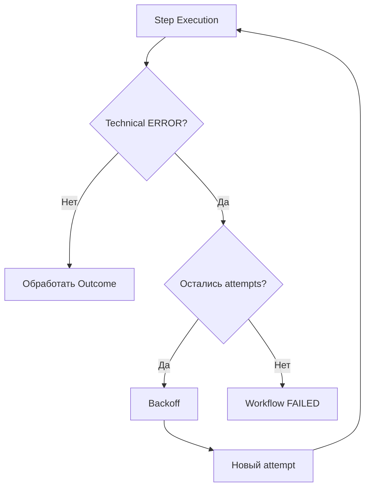

---

## 16. Пример Scenario JSON

Ниже приведён концептуальный пример, а не окончательная схема конфигурации.

```json
{
  "id": "implement-ticket",
  "trigger": {
    "source": "jira",
    "event": "issue.ready_for_development"
  },
  "start_step": "implement",
  "steps": {
    "implement": {
      "type": "agent",
      "plugins": [
        "git",
        "gitea",
        "swirl",
        "python"
      ],
      "retry": {
        "max_attempts": 3,
        "backoff": "exponential"
      },
      "transitions": {
        "SUCCESS": "review",
        "FAILURE": "implementation_failed"
      }
    },
    "review": {
      "type": "review",
      "provider": "gitea",
      "transitions": {
        "SUCCESS": "finish",
        "FAILURE": "implement"
      }
    },
    "implementation_failed": {
      "type": "command",
      "command": "store_failure_report",
      "transitions": {
        "SUCCESS": "finish",
        "FAILURE": "finish"
      }
    },
    "finish": {
      "type": "command",
      "command": "finalize_workflow",
      "transitions": {
        "SUCCESS": null,
        "FAILURE": null
      }
    }
  }
}
```

Соответствующий граф:

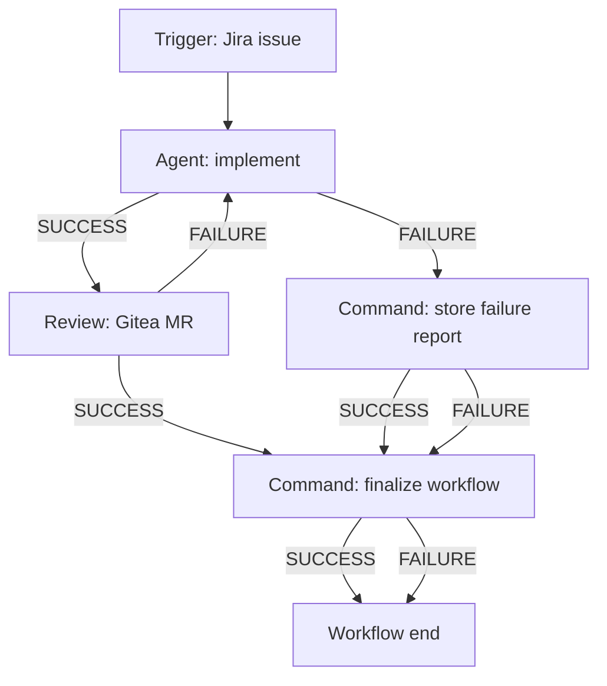

---

## 17. Итоговая архитектура монолита

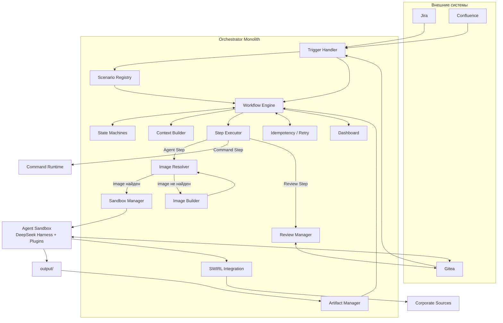

---

## 18. Ключевые архитектурные правила

1. Система реализуется как **монолит** с внутренним логическим разделением компонентов.

2. Scenario представляет собой **граф Step**, а не фиксированную линейную цепочку.

3. Для каждого Step должны быть определены переходы как минимум по `SUCCESS` и `FAILURE`.

4. Поддерживаются три типа Step:
   - `command`;
   - `agent`;
   - `review`.

5. Review является полноценным Step и блокирует workflow до пользовательского решения.

6. Пользовательское требование доработки является штатным результатом:
   - `execution_status = COMPLETED`;
   - `outcome = FAILURE`.

7. Техническая ошибка имеет:
   - `execution_status = ERROR`;
   - после неё применяется retry policy.

8. Agent Step всегда выполняется в изолированной Docker-песочнице.

9. В Scenario указываются непосредственно названия необходимых plugins.

10. Оркестратор сначала ищет готовый image с нужными plugins, а при его отсутствии может собрать и закешировать новый.

11. Агент сохраняет результат в `output/`, после чего оркестратор валидирует и нормализует его.

12. Raw output предыдущего агента не должен автоматически становиться prompt следующего агента.

13. Оркестратор формирует контекст каждого Agent Step через Context Builder.

14. Context Builder использует только релевантные данные текущего workflow: результаты, artifacts, причины outcome, пользовательские комментарии и Trigger data.

15. Workflow State Machine и Step Execution State Machine ведутся раздельно.

16. Система должна поддерживать циклы графа, например повторное выполнение Agent Step после неуспешного Review Step.

17. Idempotency должна обеспечиваться для Trigger, Step Execution и внешних операций.

18. Retry применяется к техническим ошибкам и не должен подменять переход по `FAILURE`.

19. Gitea используется для создания и review Merge Request. Агент может подготовить и опубликовать изменения в MR, но финальное принятие изменений выполняет пользователь.

20. SWIRL используется как единая точка федеративного поиска по корпоративным источникам.
