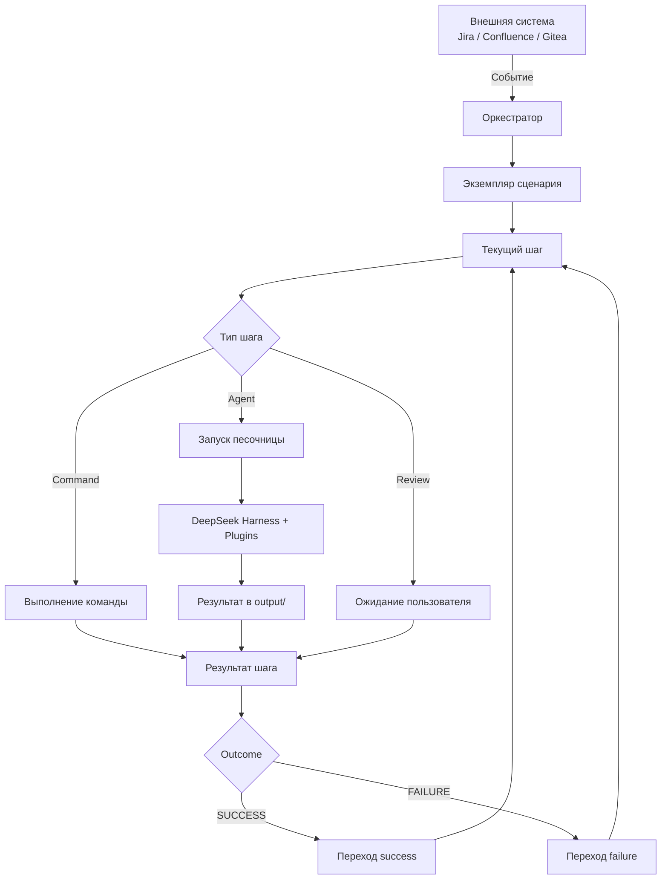
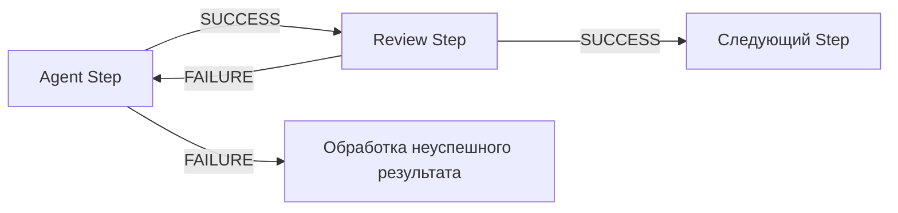

# Краткое описание ИИ-агентной платформы

## Цель

Создать ИИ-агента для автоматизации корпоративных рабочих процессов.

Система получает события из интегрированных систем, выбирает подходящий сценарий и выполняет его как граф шагов. Шаги могут запускать AI-агента, выполнять заранее заданную команду или ожидать ревью пользователя.

## Локальные аналоги для разработки

Целевыми системами остаются Jira и Confluence. До их подключения локальная разработка использует:

- Plane вместо Jira;
- BookStack вместо Confluence, с доступом через SWIRL.

Замена не меняет внутренние модели и границы интеграций: задачи поступают как внешние события, корпоративная документация — через SWIRL.

Для устройств с малым объёмом памяти предусмотрен режим, в котором Gitea запускается по требованию, а полный SWIRL и Redis заменяются лёгким совместимым поиском по локальным JSON-документам. Полный SWIRL используется только в отдельных интеграционных проверках.

## Общая схема



## Основные компоненты

### Оркестратор

Монолитное приложение, которое:

- принимает внешние события;
- выбирает сценарий;
- создаёт и ведёт экземпляр workflow;
- выполняет граф шагов;
- отслеживает состояния workflow и шагов;
- запускает Docker-песочницы;
- выбирает готовый образ с нужными плагинами;
- при необходимости собирает новый Docker-образ;
- формирует контекст для следующего Agent Step;
- управляет Review Step;
- интегрируется с Gitea и SWIRL;
- предоставляет dashboard состояния выполнения.

### Песочница

Docker-контейнер, создаваемый для отдельного запуска агента.

Внутри находятся:

- DeepSeek Harness;
- заранее установленные плагины;
- рабочее окружение;
- директория `output/` для результата.

### SWIRL

Слой федеративного поиска по корпоративным источникам. Агенты получают доступ к корпоративным данным через соответствующий plugin и SWIRL.

### Trigger

Внешнее событие из Jira, Confluence, Gitea или другой интегрированной системы, которое создаёт новый экземпляр workflow.

## Сценарий

Сценарий описывается в JSON и представляет собой граф шагов.

Каждый шаг должен иметь план перехода как минимум для двух бизнес-результатов:

- `SUCCESS`;
- `FAILURE`.

Граф может содержать циклы.



## Типы шагов

В системе предусмотрено три типа Step:

1. **Command Step** — выполнение заранее определённой команды.
2. **Agent Step** — запуск AI-агента в Docker-песочнице.
3. **Review Step** — ожидание решения пользователя.

Review является полноценным шагом workflow. Пока пользователь не завершит ревью, дальнейшее выполнение графа не продолжается.

## Review через Gitea

Агент может подготовить изменения и создать Merge Request в Gitea.

- Если пользователь принимает изменения, Review Step завершается с `SUCCESS`.
- Если пользователь оставляет замечания и требует доработки, Review Step завершается с `FAILURE`.
- Ветка `FAILURE` может вернуть workflow на предыдущий Agent Step.
- Оркестратор формирует для повторного запуска агента новый контекст с комментариями пользователя.

Финальное применение изменений требует участия пользователя.

## Plugins и Docker Images

В JSON-конфигурации Agent Step указываются названия необходимых плагинов, например:

```json
{
  "type": "agent",
  "plugins": [
    "git",
    "gitea",
    "swirl",
    "python"
  ]
}
```

Оркестратор:

1. ищет заранее подготовленный Docker-образ с необходимым набором плагинов;
2. запускает его, если подходящий образ найден;
3. если подходящего образа нет — собирает новый;
4. сохраняет собранный образ для повторного использования.

Отдельная модель permissions/capabilities на уровне сценария не требуется: сценарий задаёт именно необходимые плагины.

## Передача контекста между шагами

Результат предыдущего агента не передаётся следующему агенту целиком.

Оркестратор формирует вход следующего шага на основании контекста workflow:

- результата предыдущих шагов;
- причины `SUCCESS` или `FAILURE`;
- пользовательских комментариев;
- ссылок на artifacts;
- данных Trigger;
- конфигурации сценария.

Таким образом, следующий агент получает только релевантную для своей задачи информацию.

## Состояния и ошибки

Бизнес-результат шага отделяется от технического состояния выполнения.

**Outcome:**

- `SUCCESS`;
- `FAILURE`.

**Техническая ошибка:**

- `ERROR`.

`ERROR` не является переходом по ветке `FAILURE`: технические ошибки обрабатываются механизмом retry.

## Idempotency и Retry

Система должна:

- не создавать повторный workflow при повторной доставке одного Trigger;
- идентифицировать каждый запуск Step;
- поддерживать повторные итерации одного Step в циклах графа;
- отдельно учитывать технические retry;
- не создавать повторные внешние сущности при повторном выполнении операции.

## Определения

**Оркестратор** — монолитное приложение, управляющее сценарием, состояниями, выполнением шагов, песочницами, review и интеграциями.

**Сценарий / Workflow** — JSON-описание графа шагов и переходов между ними.

**Шаг / Step** — атомарный элемент сценария одного из типов `command`, `agent`, `review`.

**Агент** — AI-исполнитель Agent Step.

**Sandbox / Песочница** — изолированный Docker-контейнер для запуска агента.

**Plugin** — установленное в образ расширение, предоставляющее агенту дополнительную возможность.

**Agent Image** — Docker-образ с DeepSeek Harness и определённым набором плагинов.

**Trigger** — внешнее событие, создающее экземпляр workflow.

**Review Step** — шаг, ожидающий решение пользователя и завершающийся `SUCCESS` либо `FAILURE`.

**Step Outcome** — бизнес-результат выполнения шага: `SUCCESS` или `FAILURE`.

**Execution Status** — техническое состояние исполнения шага.

**SWIRL** — система федеративного поиска по корпоративным источникам.

**Context Builder** — логика оркестратора, формирующая релевантный вход следующего Agent Step из состояния и истории workflow.

**Artifact** — файл или внешняя сущность, созданная в ходе выполнения шага и доступная последующим шагам по ссылке или идентификатору.
